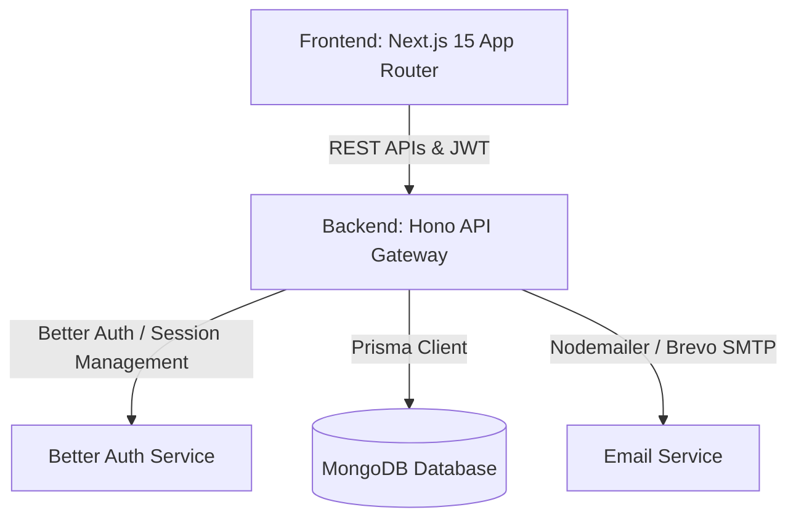

# Next Chapter: Placement Application Tracker & Transaction Extractor

A state-of-the-art, production-ready, multi-tenant enterprise application designed to parse, extract, and track placement applications (e.g., from WhatsApp/Slack placement groups) and bank transactions using robust tenant-isolated workspaces.

---

## 🏗️ Architecture & Project Structure

The project is structured as a monorepo containing two decoupled, highly optimized systems:



*   **[`nextchapter-frontend`](file:///c:/Users/Mishree/Downloads/vessify-assignment-main%20%281%29/vessify-assignment-main/nextchapter-frontend)**: A React 19 / Next.js 15 App Router application styled with a blend of Tailwind CSS and custom design tokens for light/dark theme toggle support, NextAuth (v5) credentials provider, dynamic analytics dashboards, and state-controlled interactive tables.
*   **[`nextchapter-backend`](file:///c:/Users/Mishree/Downloads/vessify-assignment-main%20%281%29/vessify-assignment-main/nextchapter-backend)**: A fast Hono API server leveraging Prisma ORM, MongoDB, Better Auth for tenant-level database isolation, custom token-bucket rate limiters, Nodemailer integration, and extensive Jest integration tests.

---

## 🚀 Key Features

### 1. Multi-Tenant Workspace Isolation
*   Every data point (Job Application, Transaction) is strictly bound to the user's active `organizationId`.
*   Data access is dynamically filtered at the ORM layer, preventing cross-tenant leakage.

### 2. High-Performance Text Extraction & Parsing
*   **Placement Messages**: Parses messy conversational placement notifications (e.g. from WhatsApp/Slack) to extract:
    *   Company Name, Job Roles/Positions, Package/Stipend details.
    *   Work Locations, Durations, Eligibility Criteria.
    *   Deadlines, Application Links.
*   **Bank Transactions**: Parses transactional SMS strings using localized parsing strategies:
    *   *Labeled Format Strategy*: Key-value mapping.
    *   *Indian Debit Format Strategy*: UPI and Net Banking messages.
    *   *Messy Bank Format Strategy*: Contextual regex extraction.

### 3. Dynamic Analytics Dashboard
*   Interactive dashboard showing vital statistics:
    *   **Total Applications**: The volume of roles tracked.
    *   **In-Progress Applications**: Open channels actively being followed.
    *   **Conversion Rate**: Visual indicators of advancement phases.
    *   **Salary/Stipend Highlights**: High/average value trackers.

### 4. Production-Ready Forgot Password Pipeline
*   Integrated nodemailer service using SMTP (configured with Brevo).
*   Signed cryptographic tokens generated for reset requests.
*   Secure UI workflow (`/forgot-password` and `/reset-password` pages) featuring strict password validation and user alerts.

### 5. Advanced UI Components & Styling
*   Clean, premium dark/light mode toggle utilizing CSS custom properties.
*   Cursor-based pagination providing smooth, duplicate-free infinite table scrolling.
*   Responsive modals and real-time status updates with toast feedback.

---

## 🛠️ Technology Stack

| Layer | Technology / Library | Description |
|---|---|---|
| **Frontend** | [Next.js 15](https://nextjs.org/) (React 19) | Application framework using App Router |
| **Frontend Auth** | [NextAuth.js v5](https://nextjs.org/) | Credentials provider wrapping backend JWTs |
| **Frontend Forms** | [React Hook Form](https://react-hook-form.com/) & [Zod](https://zod.dev/) | Client-side validation schemas |
| **Backend Framework**| [Hono](https://hono.dev/) | Ultra-fast TypeScript web framework for Node.js |
| **Database ORM** | [Prisma ORM](https://www.prisma.io/) | Schema definition, type generation, and MongoDB Client |
| **Database** | [MongoDB](https://www.mongodb.com/) | Document store for tenant workspaces, auth, and jobs |
| **Backend Auth** | [Better Auth](https://www.better-auth.com/) | Authentication, Session, and Organization Adapter |
| **Email Delivery** | [Nodemailer](https://nodemailer.com/) | SMTP service integrating with Brevo API |
| **Testing Suite** | [Jest](https://jestjs.io/), [Supertest](https://github.com/ladjs/supertest), [Playwright](https://playwright.dev/) | Integration, API validation, and E2E browser testing |

---

## 📋 API Endpoint Reference

### 🔐 Authentication
*   `POST /api/auth/sign-up`: Register new account.
*   `POST /api/auth/sign-in`: Authenticate user session.
*   `POST /api/auth/sign-out`: Terminate active session.
*   `POST /api/auth/forgot-password`: Generates cryptographic reset token and emails it.
*   `POST /api/auth/reset-password`: Processes token validation and updates passwords.

### 📁 Job Applications
*   `POST /api/job-applications/extract`: Raw message text extractor (Rate-limited).
*   `GET /api/job-applications`: Fetch applications (Supports filters, text search, cursor-pagination).
*   `GET /api/job-applications/stats`: Aggregate analytical data.
*   `PATCH /api/job-applications/:id/status`: Update workflow phase (e.g. Applied, Interviewing).
*   `DELETE /api/job-applications/:id`: Delete entry.

### 💳 Transactions
*   `POST /api/transactions/extract`: Parse bank transaction notifications.
*   `GET /api/transactions`: Paginated list of transaction logs.

---

## ⚙️ Environment Configurations

### 1. Backend Environment Setup
Create a file named `.env` in [`nextchapter-backend`](file:///c:/Users/Mishree/Downloads/vessify-assignment-main%20%281%29/vessify-assignment-main/nextchapter-backend):

```env
NODE_ENV=development
PORT=4000
DATABASE_URL="mongodb+srv://<username>:<password>@cluster0.example.mongodb.net/nextchapter?retryWrites=true&w=majority"
TEST_DATABASE_URL="mongodb+srv://<username>:<password>@cluster0.example.mongodb.net/nextchapter-test?retryWrites=true&w=majority"

# Better Auth Configuration
BETTER_AUTH_SECRET="your-32-character-better-auth-secret"
BETTER_AUTH_URL="http://localhost:4000"

# CORS
FRONTEND_ORIGIN="http://localhost:3000"

# Rate Limiting
EXTRACT_RATE_LIMIT_WINDOW_MS=60000
EXTRACT_RATE_LIMIT_MAX=12

# Brevo SMTP/Nodemailer Configuration
SMTP_HOST="smtp-relay.brevo.com"
SMTP_PORT=587
SMTP_USER="your-brevo-registered-email@domain.com"
SMTP_PASS="your-brevo-smtp-key"
EMAIL_FROM="no-reply@nextchapter.com"
```

### 2. Frontend Environment Setup
Create a file named `.env.local` in [`nextchapter-frontend`](file:///c:/Users/Mishree/Downloads/vessify-assignment-main%20%281%29/vessify-assignment-main/nextchapter-frontend):

```env
AUTH_SECRET="your-32-character-auth-js-secret"
AUTH_URL="http://localhost:3000"
NEXTAUTH_URL="http://localhost:3000"
NEXT_PUBLIC_BACKEND_API_URL="http://localhost:4000"
```

---

## 🏃 Local Quick Start

Follow these steps to run the complete environment on your local development machine.

### Backend Initialization
1. Navigate to the backend folder:
   ```bash
   cd nextchapter-backend
   ```
2. Install modules:
   ```bash
   npm install
   ```
3. Generate Prisma client & sync MongoDB schemas:
   ```bash
   npm run prisma:generate
   ```
4. Seed the database with demo admin and test values:
   ```bash
   npm run seed
   # Access using:
   # Email: mishree.demo.one@example.com
   # Password: Password123!
   ```
5. Launch the live dev server:
   ```bash
   npm run dev
   ```

### Frontend Initialization
1. Navigate to the frontend folder:
   ```bash
   cd ../nextchapter-frontend
   ```
2. Install modules:
   ```bash
   npm install
   ```
3. Start the Next.js development server:
   ```bash
   npm run dev
   ```
4. Access the client at [http://localhost:3000](http://localhost:3000).

---

## 🧪 Verification & Testing Suites

### Backend Unit & Integration Tests
Ensure backend services and tenant-isolation constraints are working using Jest:
```bash
cd nextchapter-backend
npm test
```

### Frontend Typechecking, Linting & E2E Tests
To trigger lint checkers, TypeScript compilations, and Playwright tests:
```bash
cd nextchapter-frontend
npm run typecheck
npm run lint
npm run test:e2e
```

---

## ☁️ Deployment Guide

### Database Setup
1. Deploy a free cluster on [MongoDB Atlas](https://www.mongodb.com/cloud/atlas).
2. Retrieve the connection string, replacing `<username>`, `<password>`, and target database names. Ensure Network Access permits connections from your hosting providers' IP addresses (or allow `0.0.0.0/0`).

### Backend Deployment (Render or Railway)
1. Link your repository.
2. Set the build command to `npm run build`. Note: Ensure this command triggers Prisma generation and compile:
   ```bash
   npm run prisma:generate && tsc -p tsconfig.json
   ```
3. Set the start command:
   ```bash
   node dist/src/index.js
   ```
4. Input all backend Environment Variables matching your production database, SMTP credentials, and domains.

### Frontend Deployment (Vercel)
1. Import the workspace directory matching `nextchapter-frontend`.
2. Configure environment values for `AUTH_SECRET`, `AUTH_URL` (your production Vercel domain), and `NEXT_PUBLIC_BACKEND_API_URL` pointing to your deployed backend URL.
3. Deploy.
